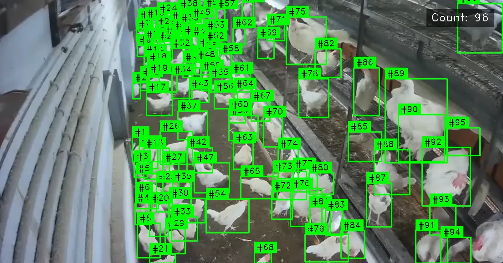

# Chicken Counting and Tracking System

Real-time chicken counting and tracking using **YOLOv11s** + **ByteTrack** with Gradio UI.



## Features

- **YOLOv11s Detection** - Fine-tuned for chicken detection
- **Sequential Counting** - Chickens numbered #1, #2, #3...
- **Video Tracking** - ByteTrack for unique ID assignment
- **CPU Inference** - Optimized for CPU by default
- **Gradio Web UI** - Easy image/video upload interface

## Quick Start

```bash
git clone https://github.com/saifyxpro/chicken-counting-and-tracking.git
cd chicken-counting-and-tracking

pip install -e .

python app.py
```

Open: http://localhost:7860

## Project Structure

```
chicken-counting/
├── app.py                    # Gradio web application
├── pyproject.toml            # Project dependencies
├── config.yaml               # Configuration file
├── src/
│   ├── detector.py           # YOLOv11s detection module
│   └── tracker.py            # ByteTrack tracking module
├── models/
│   └── chicken_yolov11s.pt   # Trained YOLOv11s model
├── assets/
│   └── demo.png              # Demo image
└── outputs/                  # Processing results
```

## Model

| Model                   | Description                               |
| ----------------------- | ----------------------------------------- |
| **chicken_yolov11s.pt** | YOLOv11s fine-tuned for chicken detection |

## Datasets

| Dataset                        | Images | Link                                                                                             |
| ------------------------------ | ------ | ------------------------------------------------------------------------------------------------ |
| Chicken Detection and Tracking | 463    | [Roboflow](https://universe.roboflow.com/chickens/chicken-detection-and-tracking)                |
| Chicken YOLO                   | 38     | [Roboflow](https://universe.roboflow.com/od-3hysf/chicken-yolo)                                  |
| Kaggle Chicken                 | 106+   | [Kaggle](https://www.kaggle.com/datasets/nirmalsankalana/chicken-detection-and-tracking-dataset) |

## Author

**Saifullah Channa** - [hello@saify.me](mailto:hello@saify.me)

## License

Apache 2.0
